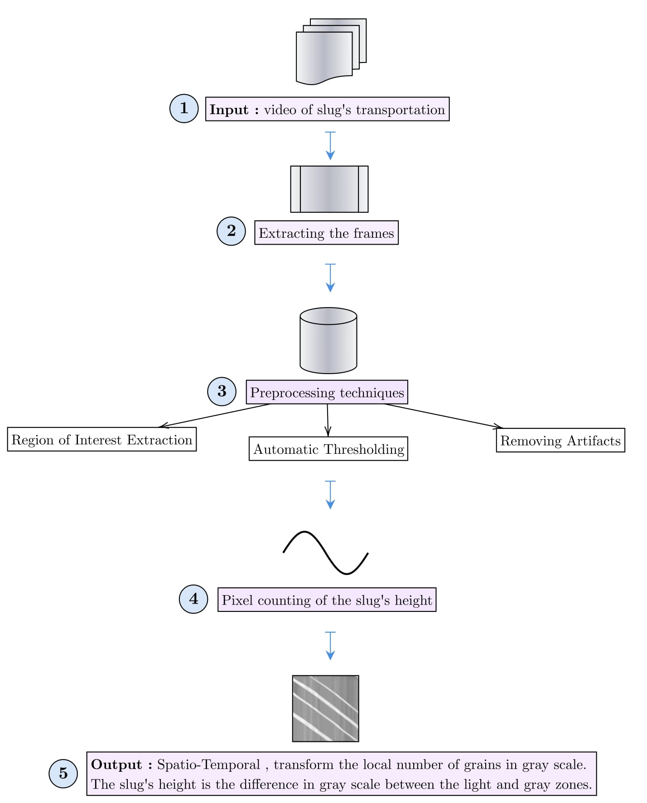

# Moving Granular Material Detector 
This project is about:
* Detecting, from an input video, a moving granular material and measuring its speed. 
* Estimating the height of this moving granular material through a Spatio-temporal figure.

